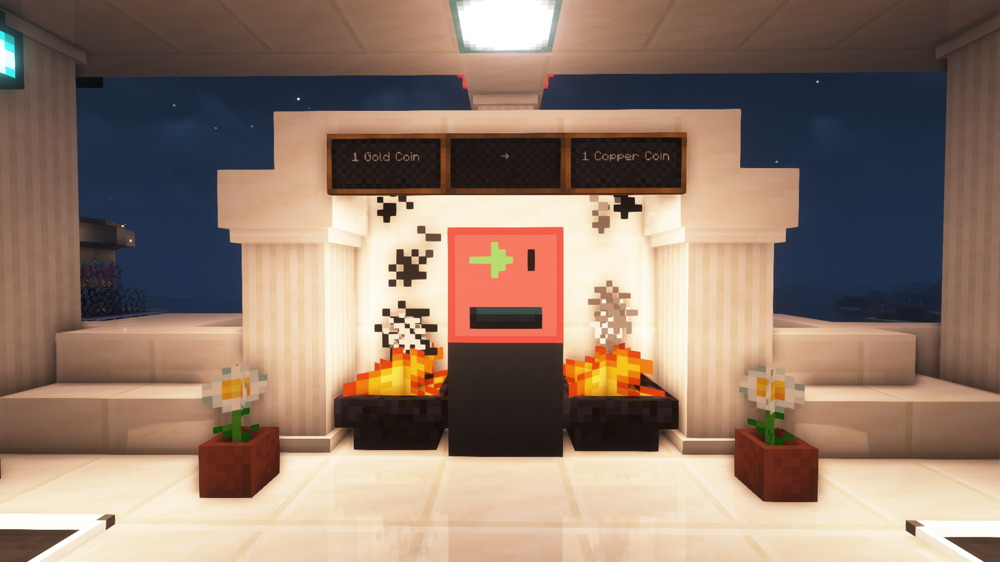
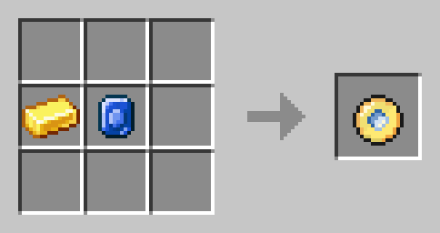
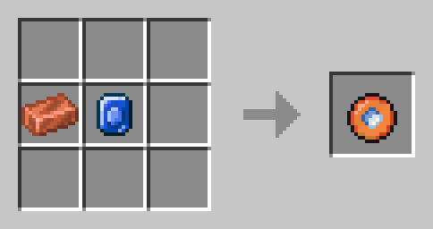
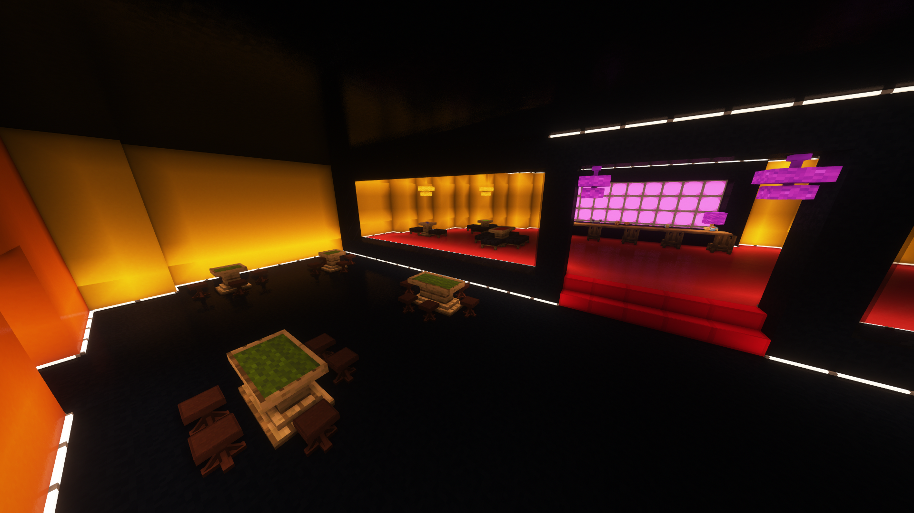
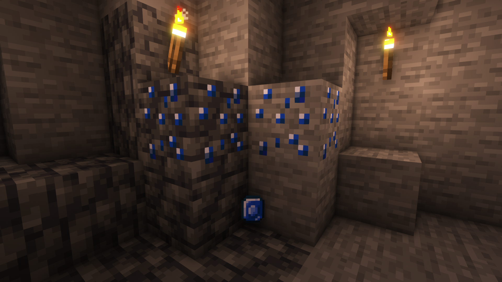
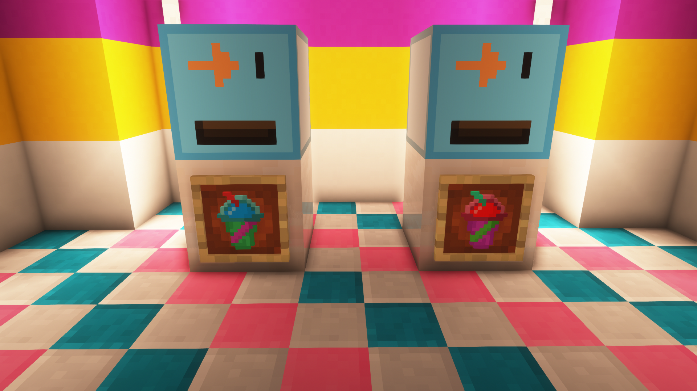

# snwy-forge-1.19
SNWY mod para Minecraft 1.19 con Forge.

# Guía orientada al servidor de SNWY 3

El mod ha sido específicamente creado para mejorar el servidor de SNWY 3, con el objetivo de cumplir las necesidades de sus usuarios. Este mod añade:

* Tiendas que venden objetos únicos.

* Economía con tres tipos de objetos.
    * **SNWY Gold Coin**: Moneda de oro que sirve para comprar en las tiendas.
    * **SNWY Copper Coin**: Moneda de cobre, con menor valor que la de oro, que sirve para comprar en las tiendas.
    * **Casino Token**: Ficha para jugar a las máquinas del casino de SNWY.

* Nuevo mineral generado en el mundo.

* Nuevos tipos de comida con efectos especiales.

* Altares de dioses con efectos especiales.

* Miscelánea.

---

## Tiendas
Existen dos tipos de tiendas distinguibles por su color, que nos permiten comprar y realizar intercambios económicos.

La forma de utilizarlas es realizando clic derecho sobre la ranura de inserción de monedas —señalada por una flecha— que se encuentra en la esquina superior derecha. A continuación, si disponemos del importe económico indicado en el cartel que muestra el precio, se sustraerá el precio de nuestro inventario y nos dará el objeto que deseamos comprar.

### Tienda roja
Permite realizar intercambios económicos. Por ejemplo, puedes convertir **SNWY Gold Coin** a **SNWY Copper Coin** y viceversa.

> Observa bien los carteles informativos que se encuentran al lado de las tiendas para saber el valor de lo que compras. Puede que para convertir una moneda a otra, el intercambio contrario **no sea equivalente**.

### Tienda azul
Permite comprar objetos en las distintas tiendas del poblado usando las monedas como forma de pago. Por ejemplo, podemos ir a la tienda de *fresisuis* y comprar un *fresisuis de fresa* por una *SNWY Gold Coin*.

---

## Economía

Las monedas son utilizadas para comprar objetos en las tiendas o para ser intercambiadas entre los jugadores, mientras que la ficha es usada para jugar en el casino.

### Monedas

Existen dos tipos de monedas:

**SNWY Gold Coin**. Moneda de alto valor. Se consigue realizando la receta:

**SNWY Copper Coin**. Moneda de bajo valor. Se consigue realizando la receta:

### Token

Existe un tipo de ficha, llamado **Casino Token**. Esta ficha se consigue intercambiando monedas en la recepción del **Casino SNWY 3**, y permite jugar a juegos como *la ruleta* o el *blackjack*.

---

## Minerales

Los minerales se encuentran entre las rocas a distintas profundidades y son usados para diferentes propósitos dependiendo de sus propiedades.

### Zafiro
El zafiro es un mineral codiciado. Es ampliamente utilizado para la creación de objetos valiosos, como las **monedas**.

Características:
* Color: Azul oscuro.
* Formación entre rocas de pizarra: Sí.
* Máxima formación de yacimiento: 6 menas.
* Máxima formación en delimitación de terreno: 5 menas.
* Probabilidad de obtener más de un mineral por mena: No.
* Altura de aparición: Entre el núcleo de la tierra y 40 metros.

---

## Comida

Existe un oponente al que hasta la persona más fuerte se tiene que enfrentar eventualmente: el hambre.

En esta sección veremos los nuevos tipos de comida que existen.

### Fresisuis

Son comprados en la tienda de dulces del pueblo y existen en una variedad de sabores:

* **Blueberry Fresisuis**: Fresisuis de arándanos que mejora la capacidad de mantener la respiración debajo del agua durante dos minutos. El subidón de azúcar aumenta la velocidad durante cuarenta segundos, pero tiene un 15% de probabilidad de causar envenenamiento y náuseas.

* **Lemon Fresisuis**: Fresisuis de arándanos que mejora la capacidad de mantener la respiración debajo del agua durante dos minutos. El subidón de azúcar aumenta la velocidad durante cuarenta segundos, pero tiene un 15% de probabilidad de causar envenenamiento y náuseas.

* **Lime Fresisuis**: Fresisuis de limón con ginseng coreano, que revitaliza al usuario permitiendo picar más rápido durante dos minutos.  El subidón de azúcar aumenta la velocidad durante cuarenta segundos, pero tiene un 15% de probabilidad de causar envenenamiento y náuseas.

* **Orange Fresisuis**: Fresisuis de naranja. La vitamina C de este batido ayuda a estar sano, ahuyentando al escorbuto y cicatrizando las heridas durante diez segundos. El subidón de azúcar aumenta la velocidad durante cuarenta segundos, pero tiene un 15% de probabilidad de causar envenenamiento y náuseas.

* **Strawberry Fresisuis**: Fresisuis de fresa que aumenta dos corazones la vida máxima y cura seis corazones. El subidón de azúcar aumenta la velocidad durante cuarenta segundos, pero tiene un 25% de probabilidad de causar envenenamiento y un 10% de probabilidad de causar ceguera durante diez segundos.

### Glowing Suppository

Técnicamente no es comida, pero comparte el orificio de salida y te hace brillar✨.

---

## Altares

Los altares son pequeños monumentos de culto que puedes encontrar en el mundo. Nadie sabe quién los puso ni con qué material los construyeron, porque moverlos del lugar donde se encuentran resulta tarea imposible. No obstante, existe un ser —natural o sobrenatural— que sí es capaz de desplazarlos, porque estuve toda una semana viajando al lugar donde se encontraba aquella estructura con forma de persona para investigarla y al octavo día desapareció... 

No pude terminar mi investigación, porque no he sido capaz de volverla a encontrar. Aunque de todas maneras, descubrí un hecho fascinante. Si coges una moneda de oro y la depositas en la pequeña caja marrón que se encuentra a sus pies, sentirás una energía recorriendo tu cuerpo. En mi caso noté como el peso de la vejez había disminuido y pude correr incluso más rápido que cuando era joven. El efecto, si bien resultó duradero, también fue perecedero y eventualmente terminó. ¿Me pregunto dónde se encontrará aquel pequeño altar?

---

## Miscelánea

El camino está iniciado, pero no se acaba aquí. Esta es una lista, en constante evolución, con algunos elementos que vendrán en un futuro:

- [ ] Nuevas armaduras con efecto activo y de set (si tienes equipadas varias piezas del mismo conjunto obtienes efectos adicionales).
- [ ] Bloques especiales que se camuflan entre los normales, pero que permiten ser atravesados sin resistencia.